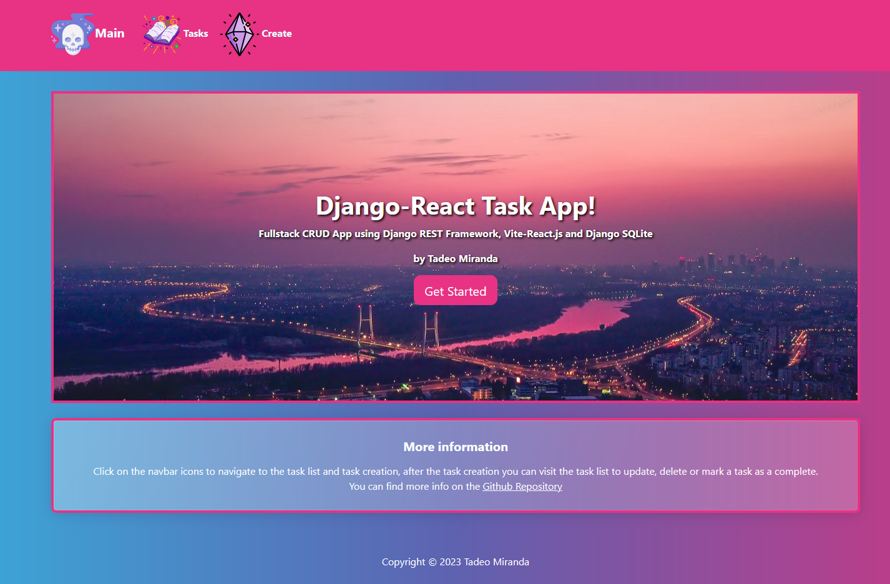
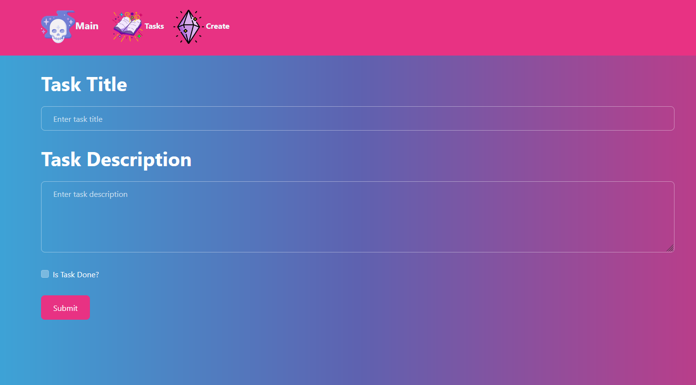
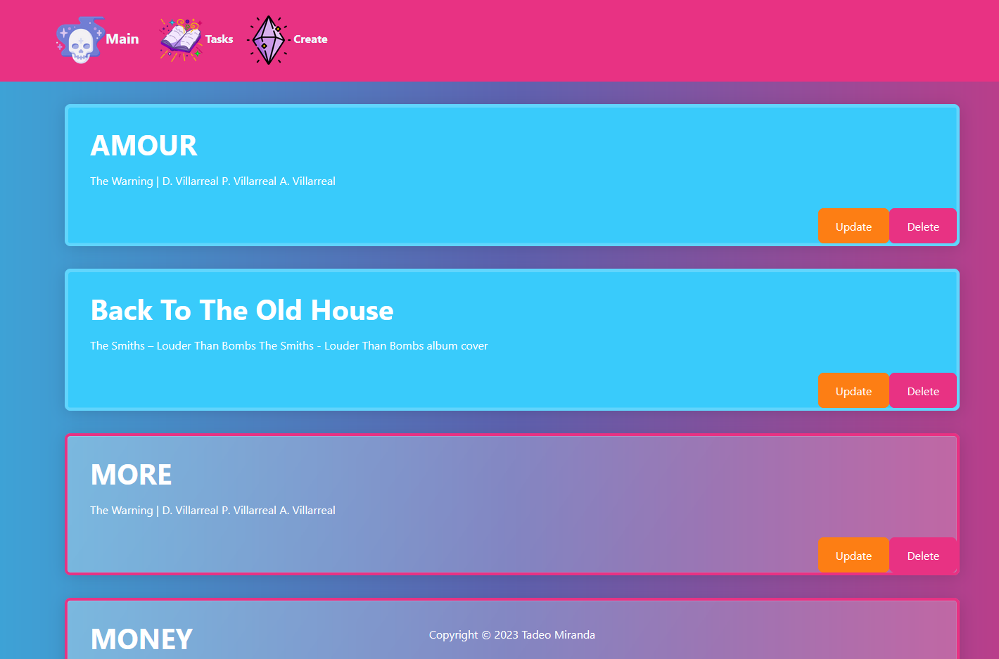
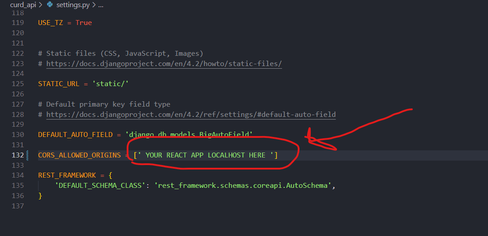
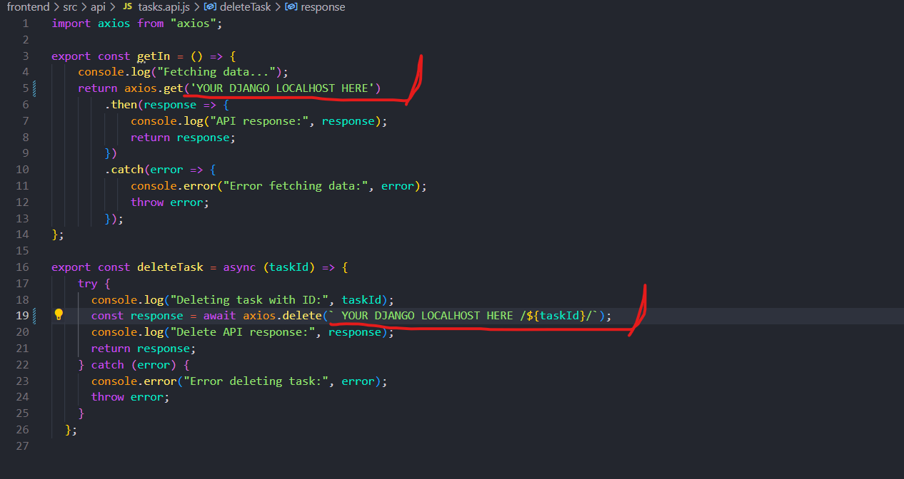

# Django - React Tasks App

This app is a versatile and efficient task management tool that allows users to create, update, and delete tasks. The system follows the CRUD (Create, Read, Update, Delete) approach, providing a smooth and efficient user experience.

## Features

- Create new tasks with a title and description.
- Mark tasks as completed or pending.
- Tasks are categorized by color into completed and incomplete.
- Tasks are organized by their creation date.
- Edit existing tasks to update details.
- Delete tasks that are no longer needed.
- Intuitive and responsive user interface.
- Communication with the backend through a REST API.

## Project Overview

1. Main Screen

2. Task Creation

3. Tasks List

## Technologies Used

- **Django**: The application's backend is built with Django, a Python web framework.

- **Django REST Framework**: We use the Django REST Framework to create a REST API that handles CRUD operations on tasks.

- **React**: The user interface is developed with React, a popular JavaScript library for building interactive web applications.

- **SQL**: 

## Installation and Setup

To run this application locally, you need to set up and run both apps. Follow these steps:

### Backend Setup

- Clone the repository.
- Create a virtual environment and install the required packages with `pip install -r requirements.txt`.
- Set up the CORS allowed origins (refer to the section **"CORS ALLOWED ORIGINS"** below).
- Perform migrations or set up another database using the following commands:
  - `python manage.py makemigrations tasks`
  - `python manage.py migrate tasks`
- Create a superuser with `python manage.py createsuperuser`.
- Run the backend server with `python manage.py runserver`.

### CORS ALLOWED ORIGINS Setup

1. settings.py:

### Frontend Setup

- Install Node.js.
- Navigate to the Frontend folder.
- Configure the `axios.get` call in "Frontend/src/api/tasks.api.js."
- Install dependencies with `npm install` and run the development server with `npm run dev`.

1. axios setup ('YOUR LOCAL HOST'/tasks/api/s1/tasks/)

## Contact

For questions or to connect, you can also visit [my LinkedIn profile](https://www.linkedin.com/in/miranda10am/).
